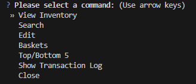

<!-- Improved compatibility of back to top link: See: https://github.com/othneildrew/Best-README-Template/pull/73 -->
<a id="readme-top"></a>
<!--
*** Thanks for checking out the Best-README-Template. If you have a suggestion
*** that would make this better, please fork the repo and create a pull request
*** or simply open an issue with the tag "enhancement".
*** Don't forget to give the project a star!
*** Thanks again! Now go create something AMAZING! :D
-->


<!-- PROJECT SHIELDS -->
<!--
*** I'm using markdown "reference style" links for readability.
*** Reference links are enclosed in brackets [ ] instead of parentheses ( ).
*** See the bottom of this document for the declaration of the reference variables
*** for contributors-url, forks-url, etc. This is an optional, concise syntax you may use.
*** https://www.markdownguide.org/basic-syntax/#reference-style-links
-->
[![Contributors][contributors-shield]][contributors-url]
[![Forks][forks-shield]][forks-url]
[![Stargazers][stars-shield]][stars-url]
[![Issues][issues-shield]][issues-url]
[![project_license][license-shield]][license-url]


<!-- PROJECT LOGO -->
<!--
<br />
<div align="center">
  <a href="https://github.com/SquallyCannon/Classwork">
    
  </a>
-->
<h3 align="center">Food Drive</h3>

  <p align="center">
    The files in this PA-Food_drive file are used for an easily navigatable food drive system.
    <br />
  </p>
</div>


<!-- TABLE OF CONTENTS -->
<details>
  <summary>Table of Contents</summary>
  <ol>
    <li>
      <a href="#about-the-project">About The Project</a>
      <ul>
        <li><a href="#built-with">Built With</a></li>
      </ul>
    </li>
    <li>
      <a href="#getting-started">Getting Started</a>
    </li>
    <li><a href="#Userside">User side UI</a></li>
    <li><a href="#Runtime">Runtime</a></li>
    <li><a href="#contact">Contact</a></li>
  </ol>
</details>


<!-- ABOUT THE PROJECT -->
## About The Project
<!--
[![Product Name Screen Shot][product-screenshot]](https://example.com)
-->
<!--
Here's a blank template to get started. To avoid retyping too much info, do a search and replace with your text editor for the following: `github_username`, `repo_name`, `twitter_handle`, `linkedin_username`, `email_client`, `email`, `project_title`, `project_description`, `project_license`
-->

<p align="right">(<a href="#readme-top">back to top</a>)</p>


### Built With

* [Python 3.14.7][Python-url]
* [questionary 2.1.1][Questionary-url]

<p align="right">(<a href="#readme-top">back to top</a>)</p>


<!-- GETTING STARTED -->
## Getting Started

<!--This is an example of how you may give instructions on setting up your project locally.
To get a local copy up and running follow these simple example steps.-->
There is one required downloaded library.

### Library

* Questionary
  ```sh
  pip install questionary
  ```

<p align="right">(<a href="#readme-top">back to top</a>)</p>


<!-- USAGE EXAMPLES -->
## Userside
<p>questionary is a python library that allows for creating a list of option that can be navigated through using arrow keys.</p>
<br />
<p>On boot up there are a few home options available; "View Inventory", "Search", "Edit", "Baskets", "Top/Bottom 5", "Show Transaction Log", and "Close".</p>
<p>View Inventory prints the inventory names, quantities, point values, and total point values for every item in the inventory.</p>
<p>Search allows for looking at a specific item by navigating through menus. It will open a list of 4 options; "Basket", "Pantry-only", "Other", and "Back" which will show all the items in their individual list or "back" will move you back to the home options menu.</p>
<p>Edit allows for changing the inventory.txt files in multiple ways: "Add quantity" and "Remove quantity" allows you to add and subtract a certain amount of an item to a specific item. "Add Basket" and "Remove Basket" adds or subtracts 1 quantity from every item in the standard basket. "Add New Custom Item" and "Remove Custom Item" allow for creating space for items not in the basket or pantry and deleting them later if needed. "Done" exits out of editing, putting you back on the home options menu. Every edit creates a log in transaction.txt</p>
<p>Baskets shows how many baskets can be made with the current inventory and what items are limiting more.</p>
<p>Top/Bottom 5 prints the items five items with the highest quantity and five items with the lowest quantity sorted by where they appear in the list.</p>
<p>Show Transaction Log prints the transaction.txt file with spacing.</p>
<p>Close closes the file.</p>

## Runtime

<div align="center">
<a href="https://github.com/SquallyCannon/Classwork/Practical_Applications/PA-Food_drive/">
    
</a>
</div>
<p>
Baskets are calculated by slitting every line in inventory.txt to get all quantities and seeing if it can make a basket. If it runs through and finds that all the quantities allow for a basket it will run again with required up by 1, otherwise it will figure out which items don't allow for making a basket and return them.
</p>
<br />
<p>
Top 5 and bottom 5 are computed using lists and sorts. Every item in the inventory will be split from it's quantity into vline (Value of line) before being put into rankv. rankv will then be sorted in reverse so the biggest quantities are first in the list. Then a for loop will run for every line in inventorybase, inside the for loop are 11 if/elif/else statements, if a value of split line [1] equals the value in the if statements rankv position it will set the as the best/worst variable that lines up with that rankv position. (0-4 is top 1-5 from top to bottom. -1, -5 is bottom 1-5 from lowest to top.). If two values of quantities are equal whichever one is first in the list will be the one that takes the slot.
</p>
<p align="right">(<a href="#readme-top">back to top</a>)</p>


<!-- CONTRIBUTING -->
### Top contributors:

<a href="https://github.com/SquallyCannon/Classwork/graphs/contributors">
  
</a>


<!-- LICENSE -
## License

Distributed under the project_license. See `LICENSE.txt` for more information.

<p align="right">(<a href="#readme-top">back to top</a>)</p>
->


<!-- CONTACT -->
## Contact

Squallycannon - malachi.arney@students.cvtech.edu

Project Link: [https://github.com/SquallyCannon/Classwork](https://github.com/SquallyCannon/Classwork)

<p align="right">(<a href="#readme-top">back to top</a>)</p>


<!-- MARKDOWN LINKS & IMAGES -->
<!-- https://www.markdownguide.org/basic-syntax/#reference-style-links -->
[contributors-shield]: https://img.shields.io/github/contributors/SquallyCannon/Classwork.svg?style=for-the-badge
[contributors-url]: https://github.com/SquallyCannon/Classwork/graphs/contributors
[forks-shield]: https://img.shields.io/github/forks/SquallyCannon/Classwork.svg?style=for-the-badge
[forks-url]: https://github.com/SquallyCannon/Classwork/network/members
[stars-shield]: https://img.shields.io/github/stars/SquallyCannon/Classwork.svg?style=for-the-badge
[stars-url]: https://github.com/SquallyCannon/Classwork/stargazers
[issues-shield]: https://img.shields.io/github/issues/SquallyCannon/Classwork.svg?style=for-the-badge
[issues-url]: https://github.com/SquallyCannon/Classwork/issues
[license-shield]: https://img.shields.io/github/license/SquallyCannon/Classwork.svg?style=for-the-badge
[license-url]: https://github.com/SquallyCannon/Classwork/blob/master/LICENSE.txt
[linkedin-shield]: https://img.shields.io/badge/-LinkedIn-black.svg?style=for-the-badge&logo=linkedin&colorB=555
[linkedin-url]: https://linkedin.com/in/linkedin_username
[product-screenshot]: images/screenshot.png
<!-- Shields.io badges. You can a comprehensive list with many more badges at: https://github.com/inttter/md-badges -->
[Next.js]: https://img.shields.io/badge/next.js-000000?style=for-the-badge&logo=nextdotjs&logoColor=white
[Next-url]: https://nextjs.org/
[React.js]: https://img.shields.io/badge/React-20232A?style=for-the-badge&logo=react&logoColor=61DAFB
[React-url]: https://reactjs.org/
[Vue.js]: https://img.shields.io/badge/Vue.js-35495E?style=for-the-badge&logo=vuedotjs&logoColor=4FC08D
[Vue-url]: https://vuejs.org/
[Angular.io]: https://img.shields.io/badge/Angular-DD0031?style=for-the-badge&logo=angular&logoColor=white
[Angular-url]: https://angular.io/
[Svelte.dev]: https://img.shields.io/badge/Svelte-4A4A55?style=for-the-badge&logo=svelte&logoColor=FF3E00
[Svelte-url]: https://svelte.dev/
[Laravel.com]: https://img.shields.io/badge/Laravel-FF2D20?style=for-the-badge&logo=laravel&logoColor=white
[Laravel-url]: https://laravel.com
[Bootstrap.com]: https://img.shields.io/badge/Bootstrap-563D7C?style=for-the-badge&logo=bootstrap&logoColor=white
[Bootstrap-url]: https://getbootstrap.com
[JQuery.com]: https://img.shields.io/badge/jQuery-0769AD?style=for-the-badge&logo=jquery&logoColor=white
[JQuery-url]: https://jquery.com 
[Python-url]: https://www.python.org/
[Questionary-url]: https://questionary.readthedocs.io/en/stable/#
